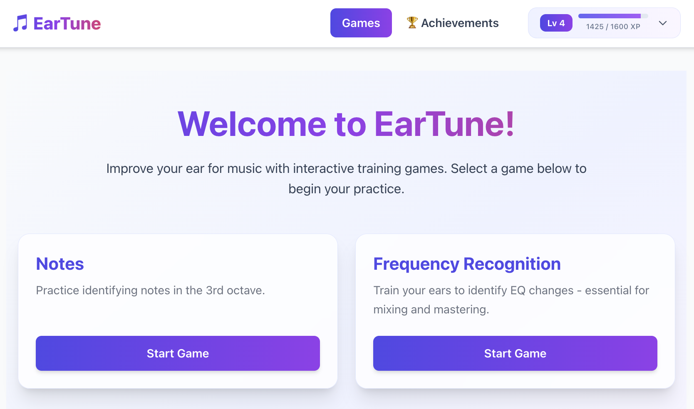
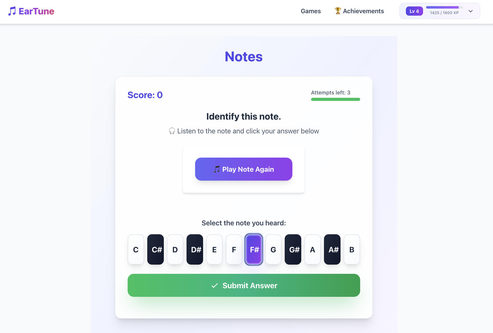
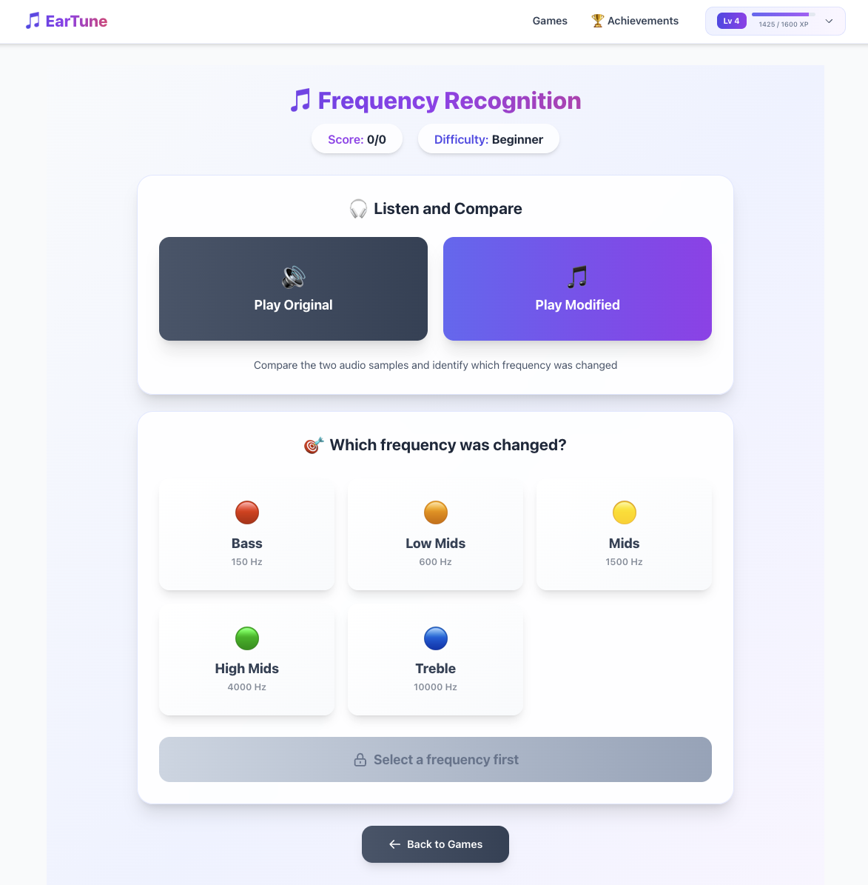
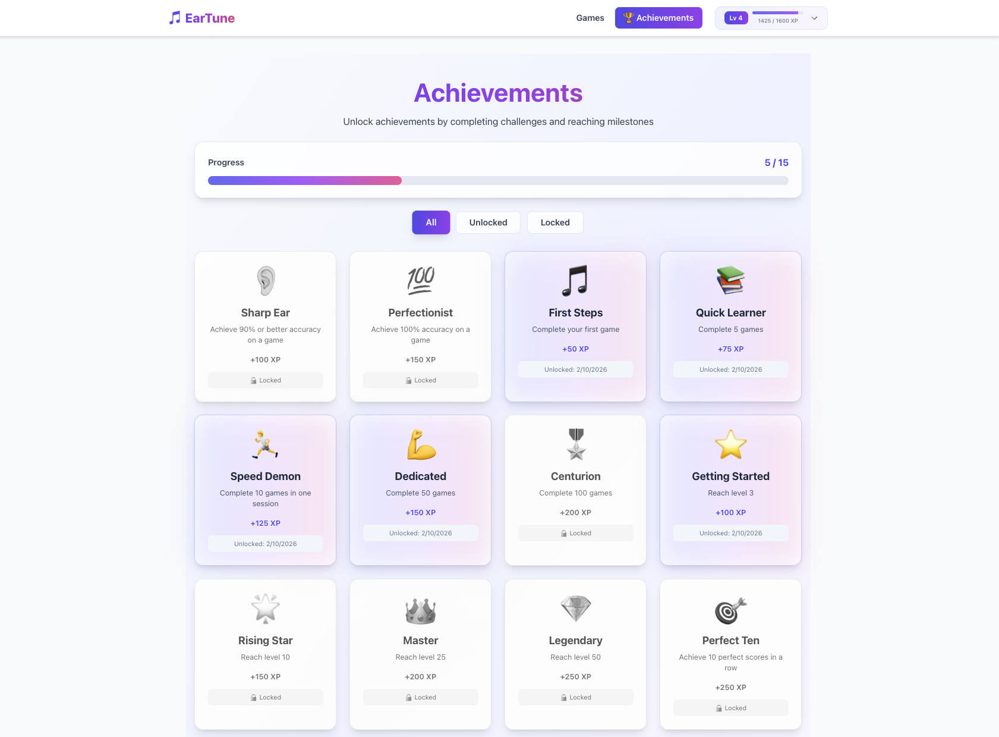
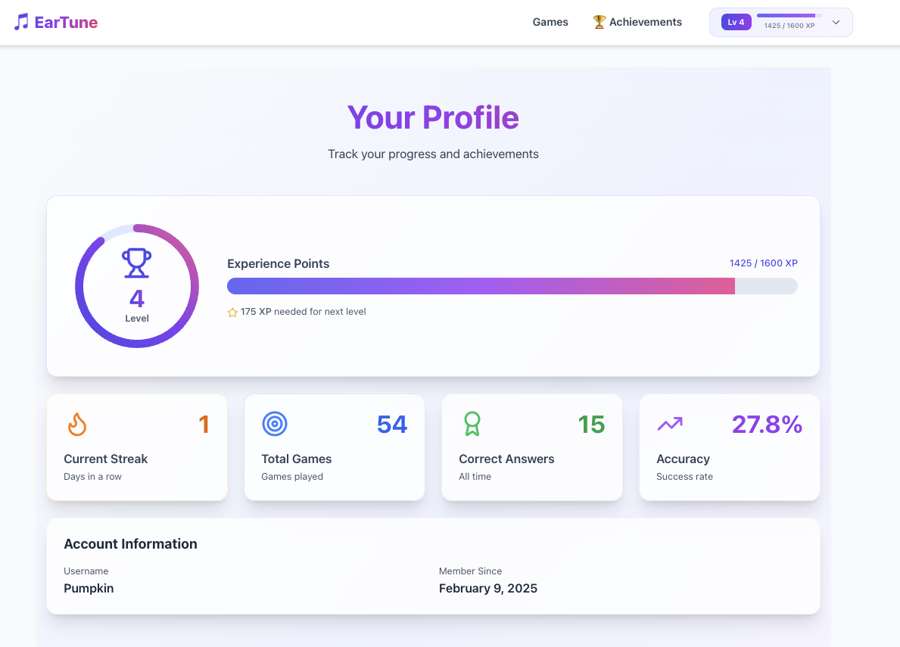

# EarTune - Train Your Musical Ear 🎵

EarTune is an interactive web application designed to help musicians develop their ear training skills through engaging, game-like exercises including note identification and frequency recognition challenges.

## Screenshots

### Game Selection

*Choose from multiple ear training exercises with beautiful card-based UI*

### Note Identification Game

*Piano-style interface for easy note selection with visual feedback*

### Frequency Recognition Game

*Identify which frequency band was modified and whether it was boosted or cut*

### Achievements

*Track your progress with unlockable achievements and badges*

### User Profile

*View your stats, level, XP progress, and game history*

## Features

### Core Functionality
- **User Authentication**: Secure register and login system with JWT token authentication
- **Gamification System**: XP, levels, and achievements to track your progress
- **Beautiful UI**: Modern, animated interface built with Tailwind CSS and Framer Motion
- **Mobile-Friendly**: Fully responsive design with mobile browser audio support

### Training Games

#### 1. Note Identification Game
- Train your ear to recognize different musical notes
- Piano-style clickable interface for easy note selection
- Visual distinction between natural notes (white keys) and sharps (dark keys)
- Three-attempt system per challenge
- Real-time score tracking and session history

#### 2. Frequency Recognition Game (NEW!)
- Browser-based audio generation using Web Audio API
- Identify which frequency band was modified (Bass, Low Mids, Mids, High Mids, Treble)
- Determine if the frequency was boosted (+) or cut (−)
- Three difficulty levels:
  - **Beginner**: ±12 dB changes
  - **Intermediate**: ±6 dB changes
  - **Advanced**: ±3 dB changes
- Pink noise generation for consistent training
- Real-time EQ filtering with adjustable parameters
- Celebration animations on correct answers

### User Profile & Progress
- **Level System**: Earn XP and level up through gameplay
- **Achievement Unlocks**: Complete challenges to earn badges
- **Compact Progress Display**: XP bar in navigation dropdown
- **Game History**: Review past sessions and track improvement

## Technology Stack

### Backend
- Django 5.1.x
- Django REST Framework
- Simple JWT for authentication
- SQLite database (development)
- RESTful API endpoints for games, challenges, and profiles

### Frontend
- React 19
- React Router 7
- Vite
- Tailwind CSS for styling
- Framer Motion for animations
- canvas-confetti for celebration effects
- Web Audio API for real-time audio generation
- Axios for API calls

## Directory Structure

```
Ear_Tune/
├── accounts/             # Django app for user authentication
├── api/                  # Django app for REST API endpoints
├── ear_tune/             # Main Django application
│   ├── models.py        # Game, Challenge, GameSession models
│   └── fixtures/        # Initial data for games and challenges
├── frontend/             # React frontend application
│   ├── src/
│   │   ├── components/  # React components
│   │   │   ├── FrequencyGame.jsx    # Frequency recognition game
│   │   │   ├── GameDetail.jsx       # Note identification game
│   │   │   ├── Navbar.jsx           # Navigation with gamification
│   │   │   ├── Home.jsx             # Game selection
│   │   │   ├── LevelUpModal.jsx     # Level up celebrations
│   │   │   └── AchievementUnlockModal.jsx
│   │   ├── index.css    # Tailwind CSS and custom utilities
│   │   └── main.jsx     # Application entry point
│   ├── selenium_tests/  # Frontend Selenium tests
│   └── ...
├── ll_project/          # Django project configuration
├── functional_tests/    # Backend Selenium tests
├── test_utils/          # Shared test utilities
├── static/              # Static files (including audio)
│   └── audio/
│       └── notes/       # Audio files for musical notes
└── ll_env/              # Python virtual environment
```

## Setup Instructions

### Backend Setup

1. Create and activate the virtual environment:
   ```bash
   python -m venv ll_env
   source ll_env/bin/activate  # On Linux/Mac
   ll_env\Scripts\activate     # On Windows
   ```

2. Install required Python packages:
   ```bash
   pip install -r requirements.txt
   ```

3. Run migrations:
   ```bash
   python manage.py migrate
   ```

4. Load fixture data:
   ```bash
   python manage.py loaddata ear_tune/fixtures/games.json
   python manage.py loaddata ear_tune/fixtures/challenges.json
   ```

5. Start the Django development server:
   ```bash
   python manage.py runserver
   ```

### Frontend Setup

1. Navigate to the frontend directory:
   ```bash
   cd frontend
   ```

2. Install dependencies:
   ```bash
   npm install
   ```

3. Start the development server:
   ```bash
   npm run dev
   ```

4. The React app will be available at: http://localhost:5173

## API Endpoints

### Authentication
- `POST /api/token/` - Obtain JWT token
- `POST /api/token/refresh/` - Refresh JWT token

### Games & Challenges
- `GET /api/v1/games/` - List all available games
- `GET /api/v1/challenges/random/?game_id={id}` - Get random challenge
- `POST /api/v1/submit-answer/` - Submit answer for note game
- `GET /api/v1/eq-challenge/random/?difficulty={level}` - Get EQ challenge
- `POST /api/v1/eq-challenge/submit/` - Submit frequency recognition answer

### User Profile & Progress
- `GET /api/v1/profile/` - Get user profile with XP and level
- `GET /api/v1/achievements/` - Get user achievements
- `POST /api/v1/game-sessions/create/` - Create new game session
- `GET /api/v1/game-sessions/history/` - Get user's game history

## Recent Updates (Latest Release)

### UI/UX Improvements
- ✅ Complete redesign of Frequency Recognition game with Web Audio API
- ✅ Piano-style button interface for Notes game (replaces text input)
- ✅ Cleaner navigation bar with dropdown menu and compact XP display
- ✅ Smooth animations and transitions throughout the app
- ✅ Celebration effects (confetti) on correct answers

### Technical Enhancements
- ✅ Fixed Tailwind CSS loading and removed conflicting styles
- ✅ Proper timeout cleanup to prevent memory leaks
- ✅ Functional state updates to prevent race conditions
- ✅ Backend sync for score, attempts, and game-over state
- ✅ Mobile browser audio support with autoplay policy handling
- ✅ Click-outside detection for dropdown menus
- ✅ Comprehensive error handling and validation

### Bug Fixes
- ✅ Fixed game-over detection and session synchronization
- ✅ Resolved state closure bugs in rapid submissions
- ✅ Added proper validation for API responses
- ✅ Fixed routing for Frequency Recognition game
- ✅ Prevented submission of incorrect data when APIs fail

## Testing with Selenium

The project includes directories set up for Selenium testing:

- `functional_tests/` - For Django/backend tests
- `frontend/selenium_tests/` - For React/frontend tests
- `test_utils/` - For shared testing utilities

### Running Selenium Tests

1. Install Selenium and WebDriver:
   ```bash
   pip install selenium pytest-selenium

   # For frontend
   cd frontend
   npm install --save-dev selenium webdriver selenium-webdriver
   ```

2. Download appropriate WebDriver for your browser
3. Run the tests (instructions to be added)

## Git Workflow

We use feature branches for development and testing:

1. Create a new branch for features or tests:
   ```bash
   git checkout -b feature/feature-name
   # or
   git checkout -b test/test-name
   ```

2. Commit changes with descriptive messages
3. Push to the remote repository
4. Create a pull request for code review
5. Merge after review and testing

## Future Enhancements

- [ ] Additional ear training games (intervals, chords, scales)
- [ ] Leaderboards and competitive features
- [ ] Daily challenges and streak tracking
- [ ] Custom difficulty settings per user
- [ ] Export progress reports
- [ ] Social features (share scores, challenge friends)
- [ ] Mobile app (React Native)

## Contributors

Cesar Villarreal

## License

[Add your license information here]
